# pertemuan 14
# 1. Pengambilan Data NO₂ dari Sentinel-5P Menggunakan OpenEO

Pada tahap ini dilakukan koneksi ke platform OpenEO Copernicus Data Space, menentukan Area of Interest (AOI) Kabupaten Sampang, kemudian mengambil data konsentrasi NO₂ dari citra Sentinel-5P.

```python
import openeo
connection = openeo.connect("openeo.dataspace.copernicus.eu").authenticate_oidc()

aoi = {
    "type": "Polygon",
    "coordinates": [
        [
            [113.10667278468316, -6.894703381663803],
            [113.44564973592355, -6.894699878993563],
            [113.44566123252753, -7.207692127698621],
            [113.10663374095788, -7.207699308529428],
            [113.10667278468316, -6.894703381663803]
        ]
    ]
}

s5post = connection.load_collection(
    "SENTINEL_5P_L2",
    temporal_extent=["2023-10-01", "2026-06-03"],
    spatial_extent={
        "west": 113.10,
        "south": -7.21,
        "east": 113.45,
        "north": -6.89
    },
    bands=["NO2"],
)

job = s5post.execute_batch(
    title="NO2 in sampang",
    outputfile="NO2sampang.nc"
)

s5p_no2_daily = s5post.aggregate_temporal_period(
    reducer="mean",
    period="day"
)

s5p_no2_aoi = s5p_no2_daily.aggregate_spatial(
    reducer="mean",
    geometries=aoi
)
```

Penjelasan:

* Melakukan autentikasi ke OpenEO.
* Mendefinisikan wilayah penelitian menggunakan polygon koordinat Kabupaten Sampang.
* Mengambil data Sentinel-5P Level 2 dengan band NO₂.
* Mengunduh hasil dalam format NetCDF (`.nc`).
* Melakukan agregasi temporal harian menggunakan nilai rata-rata.
* Melakukan agregasi spasial sehingga diperoleh rata-rata NO₂ pada wilayah penelitian.

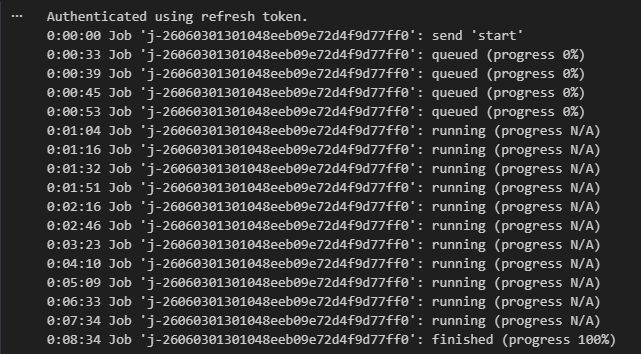
---

# 2. Membaca dan Memeriksa Struktur Data NetCDF

Tahap ini bertujuan untuk melihat struktur data hasil unduhan dan memastikan variabel yang tersedia dapat digunakan pada proses berikutnya.

```python
import netCDF4

file_path = "data/NO2sampang.nc"
ds = netCDF4.Dataset(file_path)

print("📦 Variabel dalam file:")
print(ds.variables.keys())

no2 = ds.variables["NO2"][:]
time = ds.variables["t"][:]

try:
    time_units = ds.variables["t"].units
    dates = netCDF4.num2date(time, units=time_units)
except Exception:
    dates = time

print(type(no2))
print(len(no2))
print(len(no2[0]))
print(len(no2[0][0]))
print(no2[0][0][0])

print("Contoh data pertama:")
for i in range(0, 10):
    print(no2[i])
```

Penjelasan:

* Membuka file NetCDF hasil unduhan.
* Menampilkan seluruh variabel yang tersedia.
* Mengambil data NO₂ dan waktu pengamatan.
* Mengonversi waktu menjadi format tanggal.
* Mengecek bentuk dan dimensi data.
* Menampilkan beberapa contoh data untuk proses eksplorasi awal.

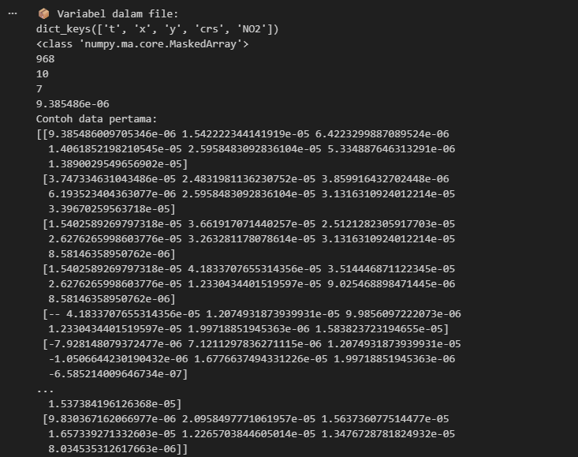
---

# 3. Menangani Missing Value dan Membuat Time Series

Tahap ini digunakan untuk mengisi data yang hilang menggunakan interpolasi linear dan mengubah data grid menjadi satu nilai rata-rata harian.

```python
import numpy as np
import pandas as pd

no2_filled = np.zeros_like(no2)
no2_filled = no2_filled.filled(0)

for i in range(no2.shape[1]):
    for j in range(no2.shape[2]):
        series = pd.Series(no2[:, i, j])
        no2_filled[:, i, j] = series.interpolate(
            method='linear',
            limit_direction='both'
        ).to_numpy()

new_dates = []
new_no2 = []

for i in range(len(dates)):
    new_date = dates[i].strftime('%Y-%m-%d')
    new_dates.append(new_date)
    new_no2.append(np.mean(no2_filled[i]))

df = pd.DataFrame({
    "date": dates,
    "NO2": new_no2
})

df.to_csv("NO2_Sampang_timeseries.csv", index=False)
```

Penjelasan:

* Mengisi nilai kosong pada setiap grid menggunakan interpolasi linear.
* Menghitung rata-rata seluruh grid pada setiap tanggal.
* Mengubah data spasial menjadi data time series.
* Menyimpan hasil ke file CSV.

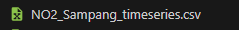
---

# 4. Memeriksa Tanggal yang Hilang

Tahap ini dilakukan untuk mengetahui apakah terdapat tanggal yang tidak memiliki data pengamatan.

```python
import pandas as pd
import numpy as np

df = pd.read_csv("NO2_Sampang_timeseries.csv")

df['date'] = pd.to_datetime(df['date'])

start_date = "2023-10-01"
end_date = "2026-06-03"

full_range = pd.date_range(
    start=start_date,
    end=end_date,
    freq='D'
)

missing_dates = full_range.difference(df['date'])

print(f"Jumlah hari missing: {len(missing_dates)}")
print("Daftar tanggal missing:")
print(missing_dates)
```

Penjelasan:

* Membuat rentang tanggal lengkap.
* Membandingkan tanggal pada dataset dengan rentang tanggal yang seharusnya ada.
* Menampilkan jumlah dan daftar tanggal yang hilang.

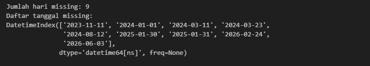
---

# 5. Melengkapi Missing Date Menggunakan Interpolasi Waktu

Tahap ini digunakan untuk mengisi tanggal yang hilang sehingga data menjadi kontinu.

```python
import pandas as pd

df['date'] = pd.to_datetime(df['date'], errors='coerce')

df = df.dropna(subset=['date'])

df = df.groupby('date', as_index=False)['NO2'].mean()

df = df.sort_values('date')

full_range = pd.date_range(
    start="2023-10-01",
    end="2026-06-03",
    freq='D'
)

df = df.set_index('date').reindex(full_range)
df.index.name = 'date'

df['NO2'] = df['NO2'].interpolate(method='time')

df['NO2'] = df['NO2'].fillna(method='bfill').fillna(method='ffill')

df.to_csv("no2_timeseries_interpolated_sampang.csv")
```

Penjelasan:

* Mengurutkan data berdasarkan tanggal.
* Membuat indeks tanggal lengkap.
* Mengisi tanggal yang hilang menggunakan interpolasi berbasis waktu.
* Menyimpan hasil interpolasi ke file baru.

---

# 6. Verifikasi Hasil Interpolasi

Tahap ini digunakan untuk memastikan tidak ada tanggal yang hilang setelah proses interpolasi.

```python
import pandas as pd
import numpy as np

df = pd.read_csv("no2_timeseries_interpolated_sampang.csv")

df['date'] = pd.to_datetime(df['date'], errors='coerce')

start_date = "2023-10-01"
end_date = "2025-09-30"

full_range = pd.date_range(
    start=start_date,
    end=end_date,
    freq='D'
)

missing_dates = full_range.difference(df['date'])

print(f"Jumlah hari missing: {len(missing_dates)}")
print("Daftar tanggal missing:")
print(missing_dates)
```

Penjelasan:

* Melakukan pengecekan ulang setelah interpolasi.
* Memastikan seluruh tanggal telah tersedia.


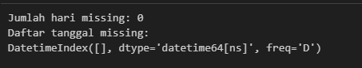
---

# 7. Deteksi Outlier Menggunakan Metode IQR

Tahap ini bertujuan untuk mengidentifikasi nilai NO₂ yang dianggap tidak normal.

```python
import pandas as pd
import numpy as np
import matplotlib.pyplot as plt

df = pd.read_csv("no2_timeseries_interpolated_sampang.csv")

df['date'] = pd.to_datetime(df['date'])

Q1 = df['NO2'].quantile(0.25)
Q3 = df['NO2'].quantile(0.75)

IQR = Q3 - Q1

lower_bound = Q1 - 1.5 * IQR
upper_bound = Q3 + 1.5 * IQR

outliers_iqr = df[
    (df['NO2'] < lower_bound) |
    (df['NO2'] > upper_bound)
]

print("Jumlah Outlier (IQR):", len(outliers_iqr))
print(outliers_iqr[['date', 'NO2']].head())
```

Penjelasan:

* Menghitung Q1, Q3, dan IQR.
* Menentukan batas bawah dan batas atas outlier.
* Mengidentifikasi data yang berada di luar rentang normal.

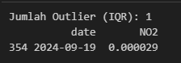
---

# 8. Visualisasi Outlier

```python
plt.figure(figsize=(15,5))
plt.plot(df['date'], df['NO2'], label="NO2")

plt.scatter(
    outliers_iqr['date'],
    outliers_iqr['NO2'],
    label="Outliers"
)

plt.axhline(
    upper_bound,
    linestyle='dashed'
)

plt.axhline(
    lower_bound,
    linestyle='dashed'
)

plt.show()
```

Penjelasan:

* Menampilkan grafik time series NO₂.
* Menandai posisi outlier.
* Menampilkan batas bawah dan batas atas metode IQR.


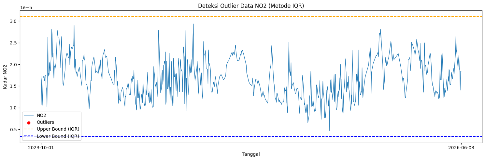
---

# 9. Menghapus Outlier dan Mengisi Kembali Nilainya

```python
df['NO2_cleaned'] = df['NO2'].mask(
    (df['NO2'] < lower_bound) |
    (df['NO2'] > upper_bound)
)

df['NO2_filled'] = df['NO2_cleaned'].interpolate(
    method='linear'
)

df['NO2_filled'] = (
    df['NO2_filled']
    .bfill()
    .ffill()
)

print(
    "Jumlah missing setelah interpolasi:",
    df['NO2_filled'].isna().sum()
)
```

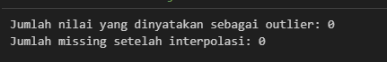
Penjelasan:

* Mengubah outlier menjadi NaN.
* Mengisi kembali menggunakan interpolasi linear.
* Memastikan tidak ada nilai kosong tersisa.

---

# 10. Visualisasi Data Setelah Pembersihan

```python
plt.figure(figsize=(15,5))

plt.plot(
    df['date'],
    df['NO2_filled'],
    label="NO2 (Interpolated)"
)

plt.show()
```

Penjelasan:

* Menampilkan data NO₂ setelah outlier dihapus dan diperbaiki.

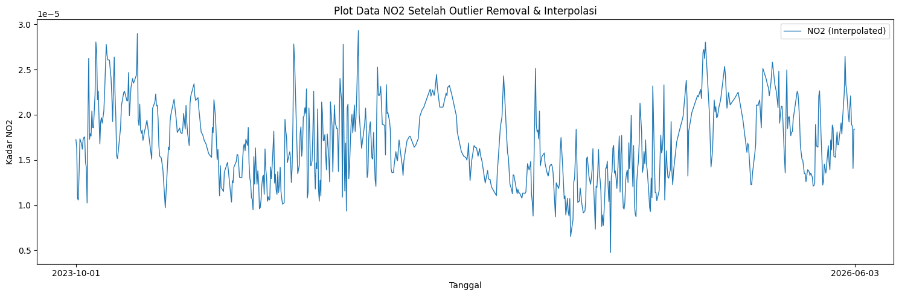
---

# 11. Normalisasi Data

```python
from sklearn.preprocessing import MinMaxScaler
import pandas as pd

scaler = MinMaxScaler()

df['NO2_scaled'] = scaler.fit_transform(
    df[['NO2']]
)
```

Penjelasan:

* Mengubah rentang data menjadi 0–1 menggunakan MinMaxScaler.
* Normalisasi dilakukan agar model KNN bekerja lebih optimal.

---

# 12. Uji Korelasi Lag Time Series

```python
import pandas as pd

def create_supervised(data, n_lag=4):
    df_supervised = pd.DataFrame()

    for i in range(n_lag, 0, -1):
        df_supervised[f'NO2(t-{i})'] = data.shift(i)

    df_supervised['NO2(t)'] = data

    df_supervised.dropna(inplace=True)

    return df_supervised

supervised_df30 = create_supervised(
    df['NO2_scaled'],
    n_lag=30
)

lag_cols = supervised_df30.drop(
    columns="NO2(t)"
).columns

correlations = supervised_df30[
    lag_cols
].corrwith(
    supervised_df30['NO2(t)']
)

print(correlations)
```

Penjelasan:

* Mengubah data time series menjadi supervised learning.
* Menghitung korelasi antara data masa lalu dan target saat ini.
* Digunakan untuk menentukan jumlah lag yang relevan.

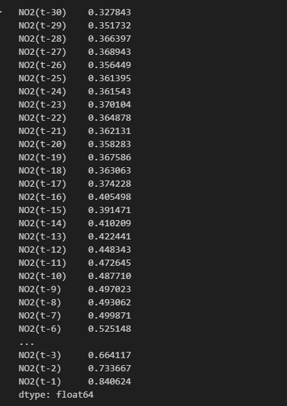
---

# 13. Membentuk Dataset Lag 4 Hari

```python
supervised_df = create_supervised(
    df['NO2_scaled'],
    n_lag=4
)

print(supervised_df)
print(supervised_df.shape)
```

Penjelasan:

* Menggunakan empat hari sebelumnya sebagai fitur prediksi.

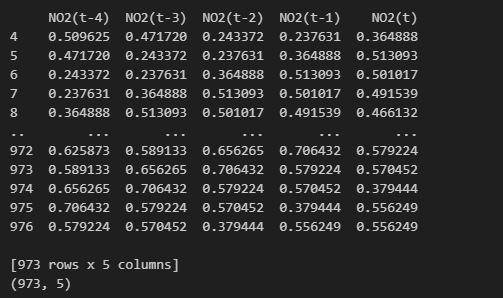
---

# 14. Membentuk Dataset Lag 10 Hari

```python
supervised_df10 = create_supervised(
    df['NO2_scaled'],
    n_lag=10
)

print(supervised_df10)
print(supervised_df10.shape)
```

Penjelasan:

* Menggunakan sepuluh hari sebelumnya sebagai fitur prediksi.

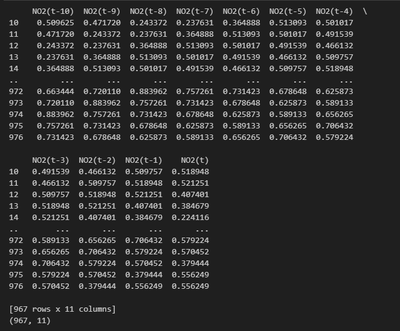
---

# 15. Membentuk Dataset Lag 30 Hari

```python
supervised_df30 = create_supervised(
    df['NO2_scaled'],
    n_lag=30
)

print(supervised_df30)
print(supervised_df30.shape)
```

Penjelasan:

* Menggunakan tiga puluh hari sebelumnya sebagai fitur prediksi.

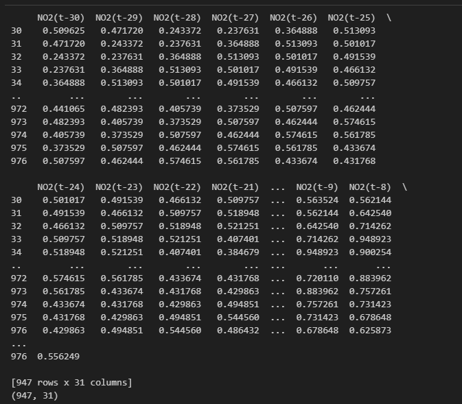
---

# 16. Pemodelan dan Evaluasi Menggunakan KNN Regression

```python
from sklearn.neighbors import KNeighborsRegressor
from sklearn.model_selection import train_test_split
from sklearn.metrics import mean_squared_error, r2_score
import numpy as np

# Seluruh fungsi MAPE dan train_knn
# sesuai kode program

knn_4, y_test_4, y_pred_4 = train_knn(
    supervised_df,
    "KNN - 4 Hari Sebelumnya"
)

knn_10, y_test_10, y_pred_10 = train_knn(
    supervised_df10,
    "KNN - 10 Hari Sebelumnya"
)

knn_30, y_test_30, y_pred_30 = train_knn(
    supervised_df30,
    "KNN - 30 Hari Sebelumnya"
)
```

Penjelasan:

* Membagi data menjadi data latih dan data uji.
* Melatih model KNN Regression.
* Mengukur performa menggunakan RMSE, R² Score, dan MAPE.
* Membandingkan performa model dengan lag 4, 10, dan 30 hari.

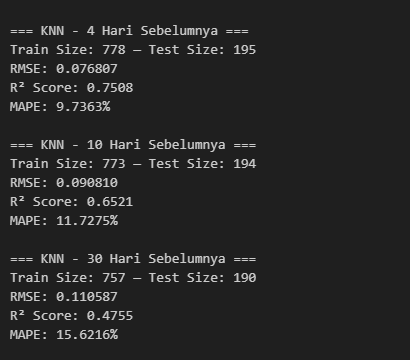
---

# 17. Visualisasi Hasil Prediksi Lag 4 Hari

```python
plt.figure()

plt.plot(y_test_4, label="Actual")
plt.plot(y_pred_4, label="Predicted")

plt.title("KNN Regression - 4 Hari Sebelumnya")

plt.legend()
plt.show()
```

Penjelasan:

* Membandingkan nilai aktual dan hasil prediksi pada model lag 4 hari.

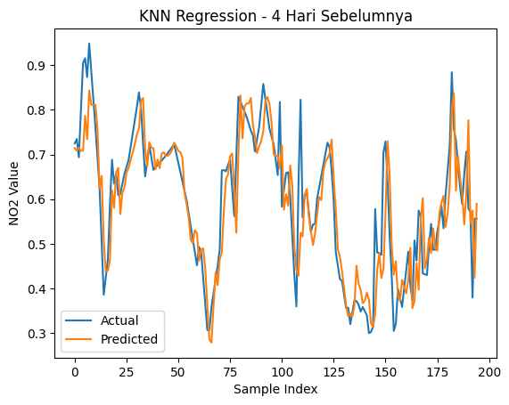

---

# 18. Visualisasi Hasil Prediksi Lag 10 Hari

```python
plt.figure()

plt.plot(y_test_10, label="Actual")
plt.plot(y_pred_10, label="Predicted")

plt.title("KNN Regression - 10 Hari Sebelumnya")

plt.legend()
plt.show()
```

Penjelasan:

* Menampilkan perbandingan hasil aktual dan prediksi untuk lag 10 hari.

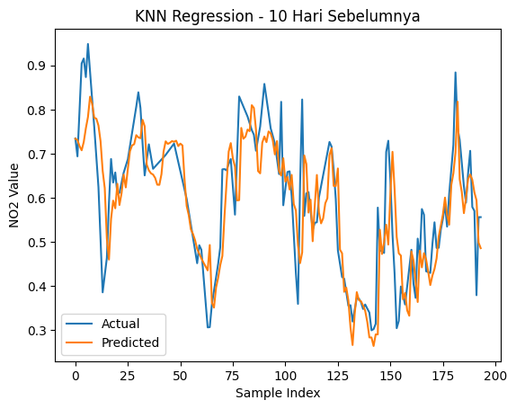

---

# 19. Visualisasi Hasil Prediksi Lag 30 Hari

```python
plt.figure()

plt.plot(y_test_30, label="Actual")
plt.plot(y_pred_30, label="Predicted")

plt.title("KNN Regression - 30 Hari Sebelumnya")

plt.legend()
plt.show()
```

Penjelasan:

* Menampilkan hasil prediksi menggunakan 30 hari sebelumnya sebagai fitur masukan.
* Digunakan untuk membandingkan performa model dengan jumlah lag yang berbeda.

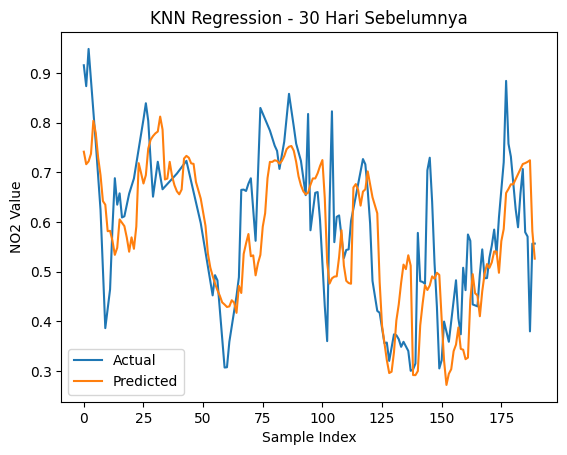