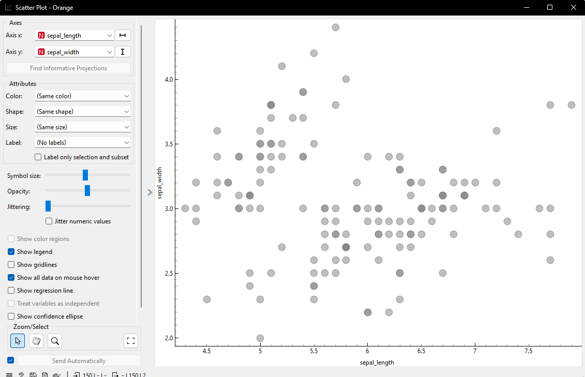

# Pertemuan 2


Data ,measurement, dan data processing <br>
## Memahami data(data understanding)
- mengumpulkan data 
- identifikasi data yang berkualitas
- pemahaman data untuk mendeteksi bagian yang menarik dari data sehingga dapat membangun hipotesa terhadap informasi yang tersembunyi
## komponen utama memahami data
|Koomponen|penjelasan|
|---------|----------|
|1. pengumpulan data awal|mengidentifikasi dan mengumpulkan semua sumber data yang relevan (database ,file csv,api,dll)|
|2. dekripsi data|memahami struktur data: jumlah baris/kolom, jenis variabl(numerik ,kategorial), nama atribut, contoh data|
|3. explorasi data(exploratory data analysis / EDA)|mencari pola,tren,korrelasi,atau anomali menggunakan statistik deskriptif dan visualisasi (grafik , histrogram, sactter plot)|
|4. kualitas data|memeriksa kelengkapan, keakuratan,konsistensi data, misalnya: apakah ada data hilang( missing value )? apakah ada duplikat atau kesalahan input?|
## atribut
- nominal / kategorikal
- ordinal
- biner
- numerik:
    interval-scalled, ratio scalled
## tugas pertemuan 2
- eksplorasi data iris 
- cari data deksriptif data
- visualisasi data

https://mulaab.github.io/datamining/memahami-data/
### kode python
```python
import pandas as pd
from scipy import stats
df = pd.read_csv("IRIS.csv")
kolom_numerik = df.select_dtypes(include=['number']).columns

for usecolom in kolom_numerik:
    print("-" * 40)
    print(f"ANALISIS KOLOM: {usecolom}")
    print("-" * 40)
    
    print("jumlah data  ", df[usecolom].count())
    print("rata-rata   ", df[usecolom].mean())
    print("nila minimal ", df[usecolom].min())
    print("Q1       ", df[usecolom].quantile(0.25))
    print("Q2          ", df[usecolom].quantile(0.5))
    print("Q3          ", df[usecolom].quantile(0.75))
    print("Nilai Max   ", df[usecolom].max())
    print("kemencengan", "{0:.2f}".format(round(df[usecolom].skew(), 2)))
    mode_res = stats.mode(df[usecolom], keepdims=True)
    print("Nilai modus {} dengan jumlah {}".format(mode_res.mode[0], mode_res.count[0]))
    
    print("kemencengan          ", "{0:.6f}".format(round(df[usecolom].skew(), 6)))
    print("Standar Deviasi    ", "{0:.2f}".format(round(df[usecolom].std(), 2)))
    print("Variansi          ", "{0:.2f}".format(round(df[usecolom].var(), 2)))
    print("\n")
col = 'species'

print("-" * 40)
print(f"ANALISIS KOLOM KATEGORIKAL: {col}")
print("-" * 40)

print("Jumlah total data  :", df[col].count())
print("Jumlah spesies unik:", df[col].nunique())
print("Daftar spesies     :", df[col].unique())

print("\nJumlah data per spesies:")
print(df[col].value_counts())

modus_spesies = df[col].mode()[0]
jumlah_modus = df[col].value_counts().max()
print(f"\nModus              : {modus_spesies}")
print(f"Jumlah kemunculan  : {jumlah_modus}")
```
## analisis iris
----------------------------------------
ANALISIS KOLOM: sepal_length
----------------------------------------
jumlah data   150<br>
rata-rata    5.843333333333334<br>
nila minimal  4.3<br>
Q1        5.1<br>
Q2           5.8<br>
Q3           6.4<br>
Nilai Max    7.9<br>
kemencengan 0.31<br>
Nilai modus 5.0 dengan jumlah 10<br>
kemencengan           0.314911<br>
Standar Deviasi     0.83<br>
Variansi           0.69<br>


----------------------------------------
ANALISIS KOLOM: sepal_width
----------------------------------------
jumlah data   150<br>
rata-rata    3.0540000000000003<br>
nila minimal  2.0<br>
Q1        2.8<br>
Q2           3.0<br>
Q3           3.3<br>
Nilai Max    4.4<br>
kemencengan 0.33<br>
Nilai modus 3.0 dengan jumlah 26<br>
kemencengan           0.334053<br>
Standar Deviasi     0.43<br>
Variansi           0.19<br>


----------------------------------------
ANALISIS KOLOM: petal_length
----------------------------------------
jumlah data   150<br>
rata-rata    3.758666666666666<br>
nila minimal  1.0<br>
Q1        1.6<br>
Q2           4.35<br>
Q3           5.1<br>
Nilai Max    6.9<br>
kemencengan -0.27<br>
Nilai modus 1.5 dengan jumlah 14<br>
kemencengan           -0.274464<br>
Standar Deviasi     1.76<br>
Variansi           3.11<br>


----------------------------------------
ANALISIS KOLOM: petal_width
----------------------------------------
jumlah data   150<br>
rata-rata    1.1986666666666668<br>
nila minimal  0.1<br>
Q1        0.3<br>
Q2           1.3<br>
Q3           1.8<br>
Nilai Max    2.5<br>
kemencengan -0.10<br>
Nilai modus 0.2 dengan jumlah 28<br>
kemencengan           -0.104997<br>
Standar Deviasi     0.76<br>
Variansi           0.58<br>

----------------------------------------
ANALISIS KOLOM KATEGORIKAL: species
----------------------------------------
Jumlah total data  : 150<br>
Jumlah spesies unik: 3<br>
Daftar spesies     : ['Iris-setosa' 'Iris-versicolor' 'Iris-virginica']<br>

Jumlah data per spesies:<br>
species<br>
Iris-setosa        50<br>
Iris-versicolor    50<br>
Iris-virginica     50<br>
Name: count, dtype: int64<br>

Modus              : Iris-setosa<br>
Jumlah kemunculan  : 50 <br>
<br>

## VISUALISASI
### column statistic

### data table

### scatter


### corelation


